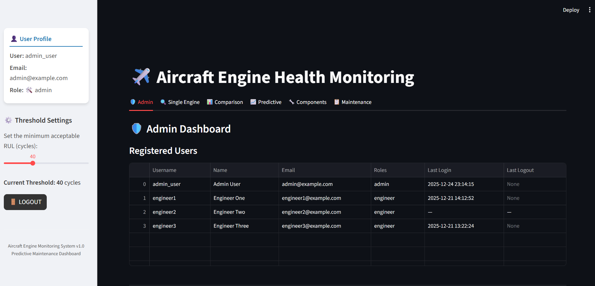

# ✈️ Aircraft Engine RUL Prediction System
### AI-powered Predictive Maintenance using Transformer-GRU and Digital Twin Technology

## 🎥 Project Demo

[▶ Watch the Project Demo](demo/Project_Demo.mp4)

---

## 📖 Overview

The **Aircraft Engine Remaining Useful Life (RUL) Prediction System** is an AI-powered predictive maintenance platform designed to estimate the remaining operational life of aircraft turbofan engines using **multivariate sensor data**.

The system combines **Transformer** and **GRU** deep learning architectures with **Digital Twin Technology** to provide:

- ✅ Accurate RUL predictions
- ✅ Real-time engine health monitoring
- ✅ Maintenance planning support

The project utilizes the **NASA C-MAPSS FD001 dataset** and provides an interactive **Streamlit dashboard** for engineers and administrators to monitor engine health, analyze degradation trends, and manage maintenance activities.

---

## 🚀 Features

### 🔐 User Authentication
- Secure login system
- Role-based access control
- Engineer and Admin dashboards

### 🤖 AI-Based RUL Prediction
- Transformer-GRU hybrid architecture
- Predicts **Remaining Useful Life (RUL)**
- Generates prediction confidence scores

### 🩺 Component Health Monitoring

Monitors critical engine parameters:

- **T2** – Total temperature at fan inlet
- **T24** – Total temperature at LPC outlet
- **T30** – Total temperature at HPC outlet
- **T50** – Total temperature at LPT outlet
- **P2** – Pressure at fan inlet
- **P15** – Pressure in bypass duct
- **P30** – Pressure at HPC outlet
- **Nf** – Physical fan speed

---

## 🧠 Deep Learning Architecture

### Transformer Encoder
- Multi-Head Self Attention
- Positional Encoding
- Layer Normalization

### GRU Layer
- Captures temporal dependencies
- Learns engine degradation patterns

### Regression Head
- Predicts Remaining Useful Life

---

## 📂 Dataset

This project uses the **NASA C-MAPSS FD001 dataset**.

**Files Used**
- `train_FD001.txt`
- `test_FD001.txt`
- `RUL_FD001.txt`

The dataset contains:

- Engine operational cycles
- Sensor measurements
- Degradation patterns
- Remaining Useful Life targets

---

## 📊 Performance

| Metric | Score |
|--------|--------|
| Validation R² | **0.91** |
| Last-Cycle Test R² | **0.89** |

---

## ⚙️ Installation

```bash
git clone https://github.com/Bhoomi002/Aircraft_Engine_Predictive_Maintenance.git
cd Aircraft_Engine_Predictive_Maintenance
pip install -r requirements.txt
```

---

## ⚙️ Configuration

1. Copy `config_example.yaml` and rename it to `config.yaml`.
2. Update usernames, passwords, and the secret key.
3. Run the application:

```bash
streamlit run app.py
```

---

## 📸 Screenshots

### 🔐 Login Page


### 📊 Dashboard


### 🔮 RUL Prediction


### 📈 Line Plot Forecast


### 🔧 Components Status


### 📋 Maintenance Log


---

## 👩‍💻 Author

**Bhoomika M**  
MCA Student, JSS Academy of Technical Education, Bengaluru

📧 Email: `mbhoomika00@gmail.com`

💼 LinkedIn: https://www.linkedin.com/in/bhoomika-m-80834a327/

---

## 📄 License

This project is licensed under the **MIT License**.
